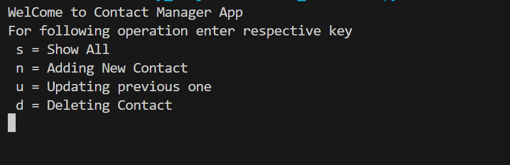

# Advanced File-Based Contact Book

---

## 🎯 **Objective:**

Develop a Python application to manage personal and professional contacts using a file-based system (CSV/JSON). The app should support advanced search, tagging, analytics, and optional business-related extensions — without relying on any database or user management system.

---

## 📋 **Functional Requirements**

### 1. **Contact Management**

* Core CRUD operations: **Add, View, Edit, Delete** contacts.

* Each contact stores:

  * Full Name
  * Phone Numbers (multiple, with labels like “mobile”, “office”, “fax”)
  * Email Addresses (multiple)
  * Address (street, city, state, country)
  * Tags (e.g., “Client”, “Supplier”, “Team”)
  * Notes or Description

* Validation:

  * Unique contact name or phone number.
  * Valid email format.
  * Clean, consistent data formatting.

* Data saved in **JSON** or **CSV** files.

* Auto-save after each operation.

---

### 2. **Search & Filtering**

* **Fuzzy search** (using `difflib` or `fuzzywuzzy`) for names, emails, and phone numbers.
* Case-insensitive searching.
* Filter by:

  * Tag (e.g., “Client”)
  * City or Country
  * Recently added or updated contacts
* Sort results alphabetically or by modification date.

---

### 3. **Import / Export**

* **Import** contacts from CSV or JSON files.
* **Export** full or filtered contacts to a new file.
* Merge duplicates intelligently (based on name or phone number).
* Option to export to **vCard (.vcf)** format for mobile compatibility.

---

### 4. **Data Storage & Backup**

* All data stored in `contacts.json` (or `contacts.csv`).
* Automatic backup after every session (timestamped).
* Configurable backup settings in `config.json`.
* Easy restore from any backup file.

---

### 5. **Security & Privacy**

* Optional **file encryption** using `cryptography` (AES/Fernet).
* Decrypt data when loading, re-encrypt when saving.
* Optionally mask sensitive data (like emails or phone numbers) in quick views.
* Confirm deletion before removing data permanently.

---

### 6. **Analytics & Insights**

* Display quick summaries, e.g.:

  * Total contacts
  * Contacts by tag/category
  * Contacts by city/country
  * Recently added or edited contacts

* Optionally visualize insights with simple charts using `matplotlib` or textual bars with `rich`.

---

### 7. **User Interface (CLI)**

* Interactive **menu-based interface**, featuring:

  * Add Contact
  * View All Contacts
  * Search / Filter Contacts
  * Edit / Delete Contact
  * Export / Backup
  * Analytics / Stats
  * Exit

* Use:

  * `rich` → for colorful tables and text.
  * `prompt_toolkit` → for improved input prompts.

---

## 💼 **Optional Business-Oriented Features**

These can be added once the core system works well:

1. **Business Profile Fields**

   * Company Name
   * Job Title
   * Department
   * Website or LinkedIn URL

2. **Client Interaction Log**

   * Track last contact date and notes from conversations.
   * Store meeting summaries or business notes.

3. **Invoice or Transaction History (Simple Version)**

   * Attach invoice records (amount, date, notes) to business contacts.
   * Save and display summaries (e.g., total invoiced to each client).

4. **Category-Based Reports**

   * Generate CSV/JSON reports for specific tags like “Suppliers” or “Clients”.
   * Optionally summarize total transactions if the invoice system is added.

5. **Business Card QR Generator**

   * Create QR codes (using the `qrcode` library) that contain the contact’s name, phone, email, and company info for easy sharing.

---

## ⚙️ **Non-Functional Requirements**

* Handle **5,000+ contacts** efficiently.
* Fully offline (no internet or database dependency).
* Modular, object-oriented structure with clear separation of logic.
* Configurable settings (file format, backup frequency, encryption) in `config.json`.
* Error-handling and user-friendly messages.

---

### 📁 **Suggested Folder Structure**

```
advanced_contact_book/
│
├── main.py
│
├── core/
│   ├── contact_manager.py
│   ├── search.py
│   ├── analytics.py
│   └── backup.py
│
├── utils/
│   ├── file_handler.py
│   ├── encryption.py
│   ├── validation.py
│   └── formatter.py
│
├── data/
│   ├── contacts.json
│   ├── backups/
│   └── config.json
│
└── ui/
    └── cli.py
```

### Screenshots
